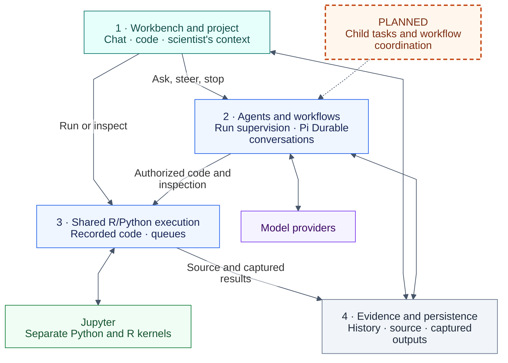
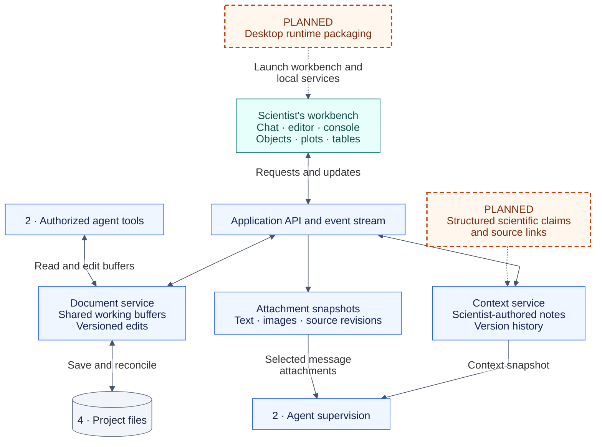
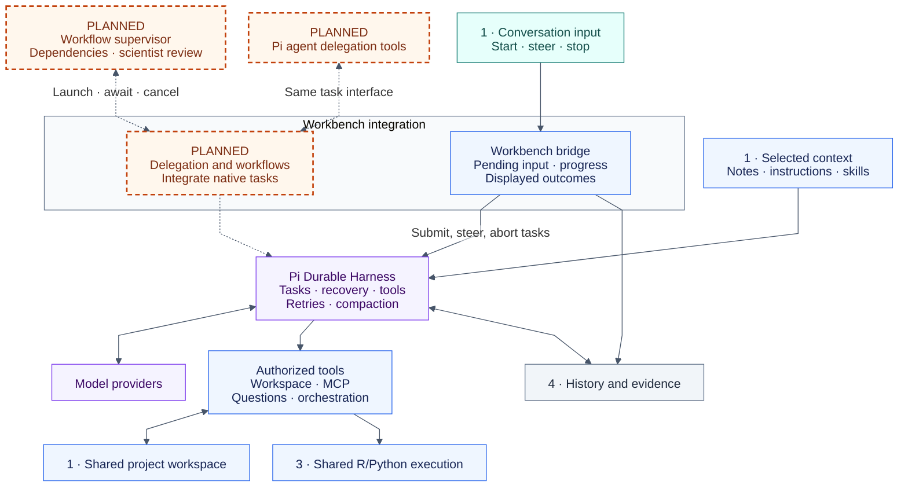
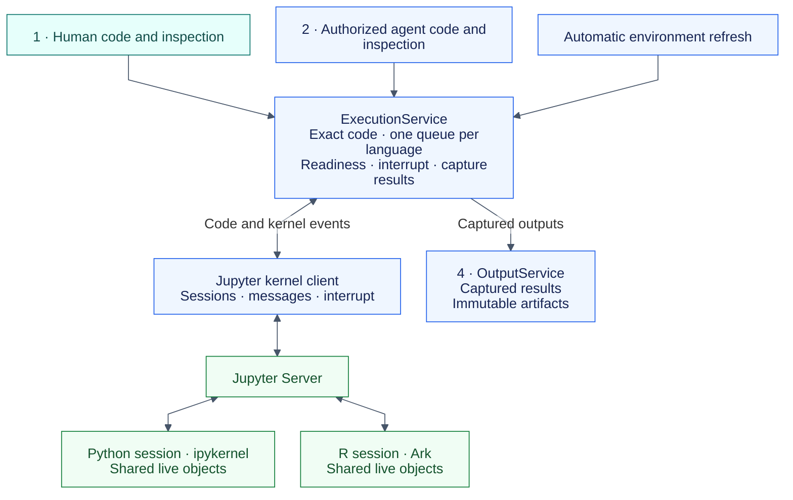
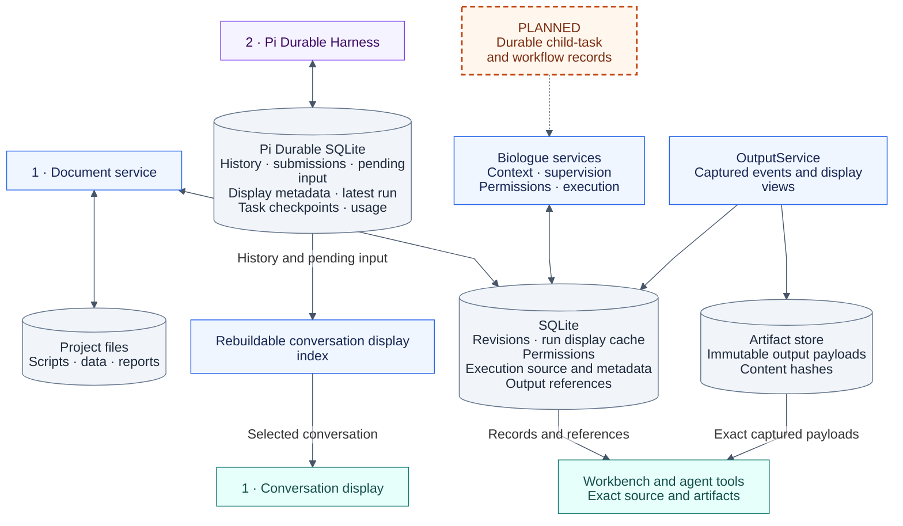

# Biologue architecture

Biologue is a scientific workbench where a scientist and agents work with the
same project files, live R and Python sessions, and recorded evidence. This
document defines the architecture of the intended product and marks which parts
are implemented. The diagrams are the primary map; each numbered area in the
overview has a matching zoom view below.

Update this document when an architectural boundary, ownership rule, or committed
capability changes. Routine features, dependency versions, tuning, and release
history belong in other documents. Setup, checks, and operational details live in
[development](docs/development.md).

## Reading the diagrams

**Solid boxes and arrows describe implemented responsibilities and connections.**
**Orange boxes with dashed borders and the word PLANNED describe committed parts
that are not implemented.** Connections involving those parts are dashed too.
Planned additions inside an existing area are shown separately from its working
core. Color otherwise identifies ownership: teal for the workbench, blue for
Biologue services, purple for Pi and model interaction, green for scientific
runtimes, and gray for storage.

Arrows show requests, data, or results. A box is a responsibility, not necessarily
a separate operating-system process. Biologue services initially remain modules
in one Node application; Jupyter and its kernels run separately.

## Overview

The workbench, agents, and workflows all operate on the same project. Agent
conversations have separate histories, while files and scientific sessions stay
shared within that project. Different projects have separate workspace state and
scientific sessions.

## 1. Workbench and project

The workbench is a React interface using Dockview for panels and CodeMirror for
editing. The same interface works in a browser or a Tauri desktop shell. Its
application API carries requests, paged results, and live updates.

The editor keeps a responsive local copy and recovery journal. Acknowledged
server revisions are the shared document authority, including unsaved edits.
Saving writes to disk; file watching and reconciliation expose conflicts for
review. Creating files, Save As, and attachment snapshots are implemented.

Scientist-authored notes have their own version history. Each model request
receives the current notes, including when an interrupted request resumes;
scientist corrections also remain in conversation history. Structured claims and source links
extend this context boundary, but currently the notes are text.

The desktop shell exists. Bundling and launching the application server and
scientific runtime as an installed desktop product remain planned. Today the
development launcher manages the local services. Browser access uses those same
services, with the application API listening locally by default.

## 2. Agents and workflows

Pi Durable owns the model loop, task checkpoints, input admission, recovery,
and canonical conversation history. Biologue supplies authorization, project
context, browser projections, and connections to the shared project. Future delegation and workflows use native Durable tasks and conversations.

Run supervision, steering, cancellation, pending input metadata, permissions,
and Pi Durable conversations are implemented. Supervisor restores project context
and tool definitions for every active run before enabling scheduling.
Pi Durable owns task lifetimes and nested code-mode calls. Delegation and workflow
coordination remain planned; their children will use separate durable conversations
and the same Biologue services. Pi resources, MCP, questions, and code mode
are connected through native tools and extensions; no AgentSession or second agent loop runs.

Task lifetime, parent/child ownership, and cancellation belong to Pi Durable.
Future delegation and workflows should compose its tasks and conversations,
keeping their application state in native documents. They do not require an
additional lifecycle service or task journal.

Biologue's permission service gates workspace edits and analysis execution
according to the scientist's selected mode. Inspection is recorded and directly
available. MCP tools use the same permission system unless declared read-only.
Connections are shared within a project. Direct tools connect during setup;
other servers connect on discovery or resource access. Code mode uses loaded
tools, so workspace-only scripts leave unused MCP servers stopped. Stopping a
response cancels its calls; project shutdown and configuration changes close
connections.
Pi's built-in shell and file-writing tools are excluded. Code mode orchestrates
tools; it does not supply a second scientific runtime. Child permissions must
stay within their caller's authorization.

Pi loads skills and project instructions and compacts its canonical history.
Pi also manages model-provider configuration and authentication on the
application side.
The default agent is a coding assistant. Project instructions, skills, and
user-authored notes supply domain-specific behavior. Pi Durable provides standard
compaction; Biologue does not impose a scientific summary policy.

## 3. Shared R/Python execution

Every request to execute scientific code or inspect live kernel objects,
including automatic environment refreshes, enters ExecutionService. Human and
agent code use the same persistent session for a language. Python and R have
separate object namespaces.

Code and source identity are captured before queuing and remain immutable.
Editing a file later cannot change what an execution record says ran. Language
adapters generate inspection requests and decode results; ExecutionService calls
the kernel client for both ordinary code and those requests.

Execution verifies a referenced working document has not changed, honors
cancellation, and reconciles uncertain kernel state before dispatch. It does not
analyze code dependencies, track what objects the agent has observed, or impose
a mandatory scientific review. Project instructions and skills supply any
domain-specific behavior.

Cancellation and shutdown cover every actor. If kernel completion cannot be
confirmed, the outcome stays uncertain and that language's session must pass a
readiness check before dispatching further execution. Nothing is automatically
replayed. Agents can reason concurrently, but kernel operations remain
serialized within each language's queue.

Execution records include exact source, actor, relevant document revision,
kernel identity, status, and output references. Recorded history does not restore
live R or Python objects.

## 4. Evidence and persistence

Each kind of state has one authority. Pi owns delivered conversation history;
Biologue owns application records; project files and captured outputs remain
independent of any individual agent session.

Accepted user input is recorded before Pi consumes it. Pending native documents
preserve queued inputs across cancellation or restart; the conversation
display is derived from Pi history plus pending inputs. The display index can be
rebuilt without changing canonical history. Conversation branching inherits
a selected history prefix; branches continue using the same project files and live kernels.
Branching, archival, and Markdown conversation export are implemented.

Execution source is stored separately from changing status metadata. OutputService
preserves captured events and immutable payloads, with a separate display view
for plots and tables. A display update points to new content rather than rewriting
historical bytes. Display identities are scoped to a kernel generation, so a
restart cannot silently overwrite an earlier figure. The workbench and agent
tools retrieve the same recorded evidence without rerunning code.

The project state directory holds application SQLite, Pi Durable SQLite, and
artifact blobs; back up the entire directory. There is no legacy-chat import.
Each conversation keeps its latest run state rather than a growing run archive.
Pending input state contains only unsent or queued messages. On delivery, the
original text and attachments move to metadata keyed by the native entry;
expanded content stays in native history. Regular queue and chat reads do not
scan old submission records. The application retains no parallel receipt archive.

Durable owns delivered model content and task history. The durable database uses SQLite
WAL with synchronous FULL and a process ownership record that prevents concurrent
harness writers. Shutdown suspends work; explicit Stop aborts it. On restart,
unfinished model requests can resume, while interrupted kernel tools settle
with unknown effects and are never replayed automatically. Browser questions
retain stable IDs and consume committed answers when safely replayed. Live kernel objects are separate
runtime state. Historical source and captured outputs remain available through
the same execution and artifact services used by the workbench.

## Implementation anchors

These entry points connect the diagrams to the code. They identify ownership,
without prescribing internal class structure or API details.

| View                          | Main implementation anchors                                                                                                                                                                                                                                                                                |
| ----------------------------- | ---------------------------------------------------------------------------------------------------------------------------------------------------------------------------------------------------------------------------------------------------------------------------------------------------------- |
| 1 · Workbench and project     | [Workbench](packages/workbench/src/App.tsx), [API composition](packages/server/src/app.ts), [documents](packages/server/src/documents.ts), [editor synchronization](packages/workbench/src/document-sync.ts), [context](packages/server/src/context.ts), [attachments](packages/server/src/attachments.ts) |
| 2 · Agents and workflows      | [Supervisor](packages/server/src/supervisor.ts), [Pi adapter](packages/server/src/pi.ts), [permissions](packages/server/src/permissions.ts), [workspace tools](packages/server/src/workspace-tools.ts)                                                                                                     |
| 3 · Shared R/Python execution | [ExecutionService](packages/server/src/execution.ts), [kernel client](packages/server/src/kernels.ts), [language adapters](packages/server/src/adapters.ts), [environment refresh](packages/server/src/environment.ts)                                                                                     |
| 4 · Evidence and persistence  | [Conversation sessions](packages/server/src/conversation-sessions.ts), [execution repository](packages/server/src/execution-repository.ts), [outputs](packages/server/src/outputs.ts), [SQLite store](packages/server/src/store.ts)                                                                        |
