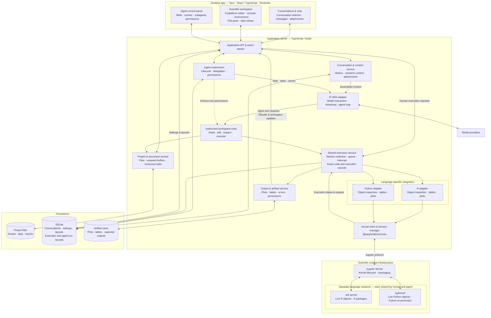
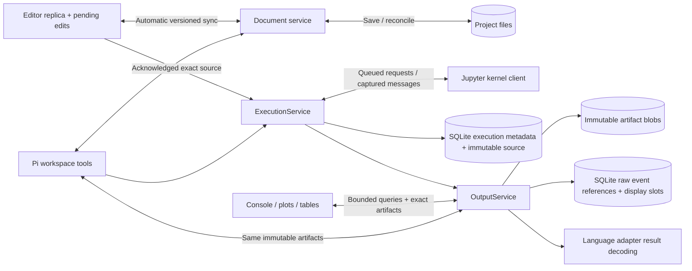
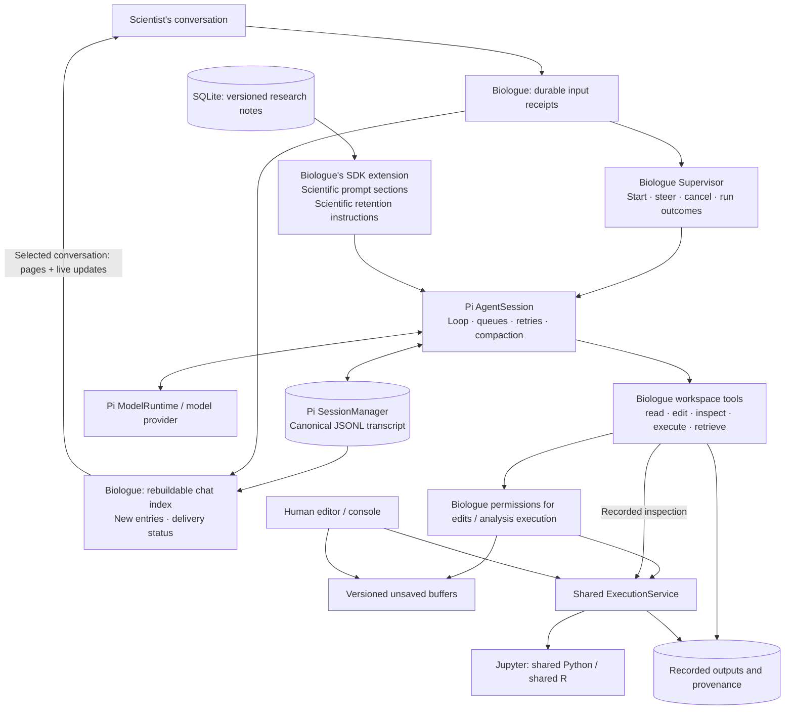

# Architecture

This is the target architecture supplied for Biologue. The first implementation
follows these service boundaries. The diagram also includes planned capabilities;
the implementation table below is the current scope.

| Boundary          | Current implementation                                                                                         | Remaining work                                                              |
| ----------------- | -------------------------------------------------------------------------------------------------------------- | --------------------------------------------------------------------------- |
| Desktop           | React, Dockview, CodeMirror, Tauri shell                                                                       | Sidecar packaging and platform releases                                     |
| API               | Local HTTP API, bounded execution snapshots, paginated output references, small SSE events                     | Authentication for any future remote deployment                             |
| Documents         | One automatically synchronized working document, versioned edits, file watching, disk reconciliation           | File creation UI, textual merge UI, attachments                             |
| Context           | Versioned scientist-authored notes; Pi owns conversation history and compaction                                | Structured claims and source links; scientific context-selection evaluation |
| Supervision       | Start, steer, cancel, input receipts, settled run outcomes, per-action permissions                             | Delegation and reusable permission policies                                 |
| Execution         | One FIFO per language; exact source; stale-context checks; cancellation and shutdown for every actor           | Complete runtime/environment provenance                                     |
| Outputs           | Separate OutputService, immutable blobs, kernel-scoped display slots, typed inspections, paged references      | More MIME formats                                                           |
| Pi                | AgentSession, SessionManager, ModelRuntime, standard resource loading, retries and scientific compaction hook  | Live-provider smoke tests; skill-management and session-tree UI             |
| Language adapters | Python/Ark execution, names/types/previews, data frame previews                                                | Richer object types, Ark comms and LSP                                      |
| Persistence       | Pi JSONL; SQLite domain records, execution summaries/source and output references; content-addressed artifacts | Archival/export UI                                                          |

An execution record snapshots code at submission. Editing its source afterward
does not change that record. Human requests enter through the API; agent requests
enter through the supervisor's tools. Both arrive at the same execution service.
R and Python never share an object namespace.

## Runtime context checks

Agent analysis requests carry their conversation identity. `ExecutionService`
parses submitted R/Python code with MIT-licensed Tree-sitter grammars running in
Node through WebAssembly. This only parses text; it never executes code in a
second language runtime. Analysis extracts likely reads, assignments, removals,
mutations, and possible aliases. Unsupported syntax, unfamiliar calls, and R
nonstandard evaluation retain explicit uncertainty. Function bodies are not
treated as immediate executions. A small list of ordinary calls is a heuristic,
not a guarantee of purity under custom dispatch or rebinding.

SQLite indexes execution order and possible effects. Activity is recorded at
kernel dispatch, so cancelled queued requests and stale-context warnings do not
advance the activity sequence. Failed, interrupted, or abandoned dispatched
code remains potentially relevant. These numbers order activity; they do not
version the contents of objects.

Observation receipts accompany tool results and are indexed when Pi assembles
them into model context. Each conversation has its own observations. Receipts
distinguish bounded environment previews from successful execution results;
neither implies a complete examination of an object's contents. Only explicitly
returned environment rows establish preview observations. `inspect_environment`
accepts optional names to retrieve objects omitted from a bounded response.
Historical artifact previews retain their original execution checkpoint and
cannot advance or overwrite a newer observation. Reading a script or execution
source alone does not refresh live-object observations. Pi remains the canonical
transcript; this index contains references and coverage metadata only.

After approval and queue wait, the backend supplies its kernel identity through
a synchronous callback immediately before `requestExecute`. While still owning
that language's execution slot, the service compares candidate inputs and
overwrite targets with intervening activity and checks that any declared document
reference still matches the current buffer. Jupyter connections track a generation in addition to the kernel
ID, because restarts can retain the ID. A `kernel_info_request` handshake obtains
the live process's sender-session identity before the check; it executes no
scientific code. Reconnection is conservatively treated as a new generation too.

A relevant conflict records `not_executed`. The model receives a short “Not run”
tool result with affected objects and source excerpts grouped by execution. Retry
instructions live in the tool definition. No code execution request is sent, the
queue is released, and Pi receives an ordinary actionable tool result. The agent
can inspect, revise, or supply `acknowledgment: { warningExecutionId, reason }`.
Acknowledgments cover only the shown evidence, exact code hash, conversation,
language, and kernel generation. New changes are checked on every attempt;
acknowledgment does not grant execution permission. Exact proposals, warnings,
and reasons remain in execution records. The console labels these attempts
“Needs review · not run”. No additional model or paid background request is used.

The check is advisory evidence analysis, not a transaction or complete dependency
graph. Conservative alias links can cause extra warnings after rebinding. Limits
on dependencies, aliases, and warning history are reported as uncertainty. Native
inspection helpers are treated as observations rather than source-level writes;
their custom object representations can still have side effects. Background
tasks, external files, custom dispatch, and execution outside the harness are not
fully tracked. Absence of a warning does not certify unchanged scientific inputs.

Research context has its own version history. Each agent run records the context
version it received. The application can verify that a correction reaches the
next run; deciding whether the model uses it scientifically requires evaluation
with scientists.

## Working documents, execution, and outputs

These components remain modules within the same Node application:

`document-sync.ts` owns the editor synchronization state machine. The local copy
is a responsive replica and recovery journal, not a separately published document.
Edit IDs survive retries, and acknowledgements advance the base of newer local
edits without discarding them. External changes are reconciled by `Documents`,
which preserves historical source revisions and detects interrupted saves.

`ExecutionRepository` stores immutable code separately from status metadata.
`ExecutionService` owns scheduling, cancellation, and shutdown for every actor.
An output does not rewrite the execution record. `OutputService` stores each raw
event with a payload reference and maintains a separate display projection. A
slot's artifact ID changes when its content changes; historical IDs continue to
retrieve historical bytes. Display IDs are scoped to the kernel. Inspection
responses are decoded and validated by the language adapter at the server boundary.

The API streams small status and output-invalidation events. Initial execution
history and output queries are bounded in SQL; source and payload bodies are loaded
explicitly. The workbench uses selector subscriptions and throttled metadata queries.
Subscriber failures cannot prevent queue cleanup. Shutdown drains/cancels all
actors before kernel connections and storage close, with abandoned status when
kernel completion cannot be confirmed.

## The implemented Pi boundary

Biologue embeds the **AgentSession SDK** from `@earendil-works/pi-coding-agent`,
pinned to 0.87.1 alongside its Pi dependencies. Biologue no longer constructs an
`Agent` or runs a separate turn loop. The SDK owns requests, tool dispatch,
steering, retries, context projection, and automatic compaction. Biologue waits for
its complete recovery and idle lifecycle before assigning a final run outcome.
There is no Biologue twelve-turn cutoff; an unrecovered truncated or aborted response
is not a completed run.

`pi.ts` configures the SDK, provider runtime, resource loader, and Biologue's inline
extension. `supervisor.ts` manages application runs and maps SDK events to the
workbench. `conversation-sessions.ts` connects each conversation to its Pi session
file, projects chat messages, imports older histories, and reconciles input
receipts. `workspace-tools.ts` exposes the application services as Pi tools.
`tool-results.ts` formats their model-facing content following Pi's built-in
read/bash/write tools: plain output, concise parameter descriptions, and
continuation hints only when a result is truncated. Model content does not include
execution-record envelopes, hashes, session/kernel IDs, sequence numbers, or empty
fields. Durable records retain that metadata; observation receipts travel in Pi's
`details`, outside model-facing content. Source revisions and retrieval IDs remain
visible where needed. Warnings group shared source evidence, and artifact reads
select one representation rather than repeating text, HTML, and JSON. Image
attachments are sent on the first page only. File lists, file contents, output
previews, inspections, and artifact text have bounded pages with retrieval paths.
Historical environment artifacts establish observations only when their complete
contents fit in the delivered page; partial JSON never credits unseen objects.

The conversation display index is a derived SQLite read model. It is rebuilt lazily
from a selected Pi session and its pending receipts on first use after startup.
Ordinary updates traverse only entries added since the last observed Pi leaf;
branch changes rebuild the selected view and invalidate its UI history. Stable
message IDs and indexed ordering support cursor pagination and delivery updates.
The index can be discarded and rebuilt without changing Pi history.

Workspace snapshots contain conversation metadata but no transcripts. The
workbench requests the selected conversation's latest 50 messages and loads
older pages explicitly. Live updates merge by identity; a late page cannot
replace a newer delivery status, a switched conversation, or a reconnect refresh.
Opening a session still requires Pi to load that session's canonical transcript.

Each Biologue run gets an AgentSession attached to the conversation's existing
SessionManager. The live AgentSession is disposed when the run settles; the
transcript and shared scientific kernels persist independently. The model runtime
is reused. SDK session branching remains available in the dependency but is not
exposed in Biologue's UI.

Agent startup writes its run metadata transactionally before reserving an active
slot. An already accepted input remains recoverable if startup fails. Cleanup
attempts each operation independently, always releases the active slot, and reports
integration or persistence failures in the final run event. Cancellation starts
both Pi abort and execution cancellation before awaiting either, and shutdown
waits for every run. Deferred message publication failures enter the same handled
stop path.

A permission allowance is usable only after the decision is recorded. Failed
writes reject the waiting tool, remove the pending request, and report the error
to the UI. Cancellation settles every matching permission even if individual
records fail. If final run persistence is unavailable, the live failure is still
reported; an unfinished durable record is marked abandoned on restart.

## Context and scientific knowledge

At the start of a run, Biologue snapshots the collaborator prompt and the current
version of the scientist's project notes. A `before_agent_start` extension adds
the notes as a named system-prompt section, labelled as the scientist's account,
and adds the shared-workspace rules. Changes to the notes apply to the next run;
a message sent during a run enters Pi's steering queue.

Agent instructions have one home per purpose: `prompts/collaborator.md` describes
scientific collaboration; the workspace section describes shared runtime state;
tool declarations explain use and retry mechanics. Results report evidence or a
specific failure, with continuation hints only when needed. The notes section
contains the scientist's text and version, without additional behavioral rules.
The collaborator prompt does not prescribe a reporting template or ask the agent
to maintain a separate investigation record.

Pi assembles the model context from its canonical transcript, system-prompt
updates, active tool declarations, and discovered skill descriptions. Workspace
files and runtime objects enter through explicit tool calls. Biologue does not inject
the whole project or all scientific data into every request. Reads include the
current shared buffer version, bounded ranges, and continuation offsets. Recorded
executions and artifacts can be retrieved without executing code again; captured
PNGs are returned as images to models that support them.

Automatic compaction uses Pi's preparation, summary generator, retry policy,
and persistence. Biologue's `session_before_compact` hook supplies instructions to
retain observations, sources, interpretations, assumptions, corrections,
uncertainty, negative results, and evidence IDs distinctly. Both history and
split-turn summary requests receive one copy of this policy and the current notes, through
the SDK-configured model stream. Raw history remains
in the Pi session file. Current versioned notes are supplied again independently
of the summary. If scientific compaction fails, the run reports that failure;
it does not silently generate a generic fallback summary. This policy guides
model behavior; scientific retention quality still needs domain review.

The standard Pi resource loader discovers skills, including project
`.pi/skills/<name>/SKILL.md` files and skills under the configured agent directory.
The custom `read` tool supports these resources, including read-only references
under their skill directories. Only Biologue's inline extension is loaded; external
extensions, context files, and themes are disabled. Native file-writing and shell
tools are not selected. Edits affect versioned buffers and require approval;
analysis execution requires approval and always enters ExecutionService.
Environment inspection retains the existing recorded, ungated inspection policy.
Idle cache warming is disabled, so it does not initiate background paid requests.

## Persistence, delivery, and compatibility

The state directory contains `pi/sessions/` for Pi JSONL files, `carl.sqlite` for
project/conversation metadata, notes, documents, executions, permissions, and
run records, and `artifacts/` for captured output. Pi settings and optional
model/auth configuration live under `pi/`; project `.pi/settings.json` is also
handled by the SDK. Back up the complete state directory, not just SQLite.

Pi is the authority for delivered conversation history. SQLite input receipts
record accepted text before submission to Pi. This is needed because steering
queues are transient and Pi defers a new session's first disk flush until an
assistant message exists. A receipt is delivered when its stable ID appears in
the Pi transcript. Pending inputs remain visible as queued, survive restart,
and are inserted into Pi's history before the next user prompt. A receipt's
delivery status means inclusion in the conversation, not proof that the model
understood it. Repeated text retains separate message identities.

Finalized messages carry Biologue run/input IDs outside their model-visible content.
Run records retain the research-context version, SDK version, Pi session and
entry references, and tool-call-to-execution links. Request records reference
Pi context and active tool schemas rather than maintaining a second full
transcript. The UI derives its chat from Pi entries plus pending inputs.

Existing SQLite transcripts and display-only chat messages are imported on first
use, including corrections the previous queue failed to deliver. The original
rows remain as migration evidence; new runs do not write a second SQLite
transcript. Unanswered historical tool calls are omitted through Pi's append-only
context edits with an explicit uncertainty note, while their raw records remain.
No interrupted code is replayed. A missing previously persisted session file is
reported as an error instead of silently starting fresh.

The supervisor also uses Pi's typed prompt preflight callback to honor a stop or
integration failure during asynchronous authentication/compaction, before the
abortable agent loop starts. This small compatibility bridge is covered by
regression tests against the pinned SDK.

See the [Pi session SDK documentation](https://github.com/earendil-works/pi/blob/v0.87.1/packages/coding-agent/docs/sdk.md)
and the historical [boundary audit](pi-boundary-audit.md).
Kernel execution uses the
[`@jupyterlab/services` kernel connection](https://jupyterlab.readthedocs.io/en/stable/api/classes/services.KernelConnection.html).
Ark provides an [R kernel that speaks the Jupyter protocol](https://github.com/posit-dev/ark).
The application uses standard notebook messages for this integration.
