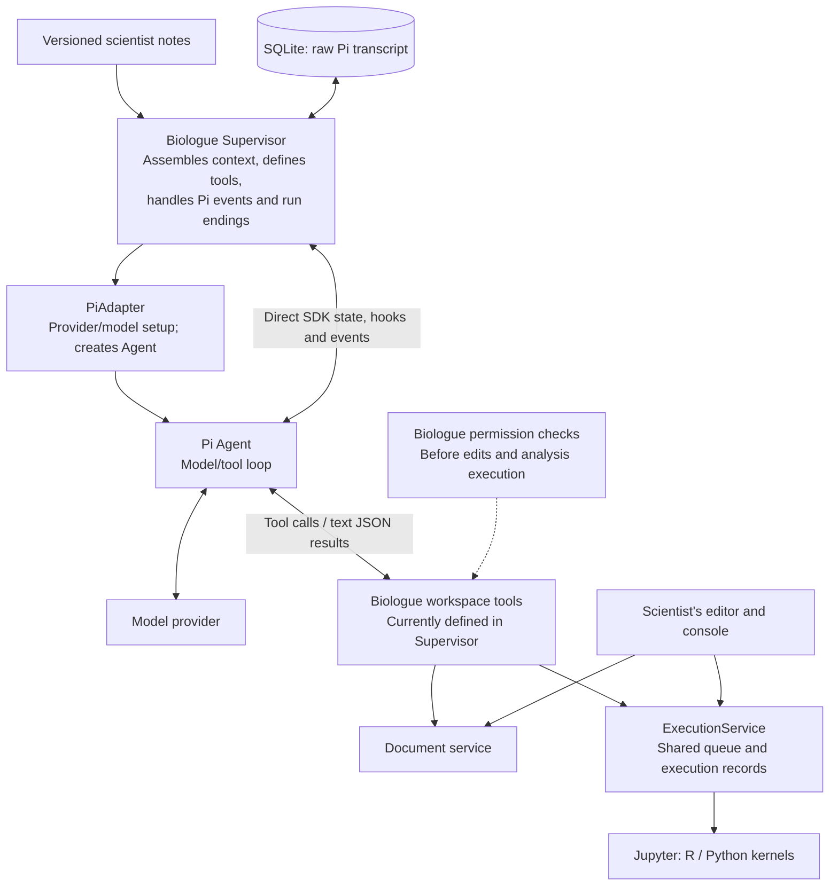
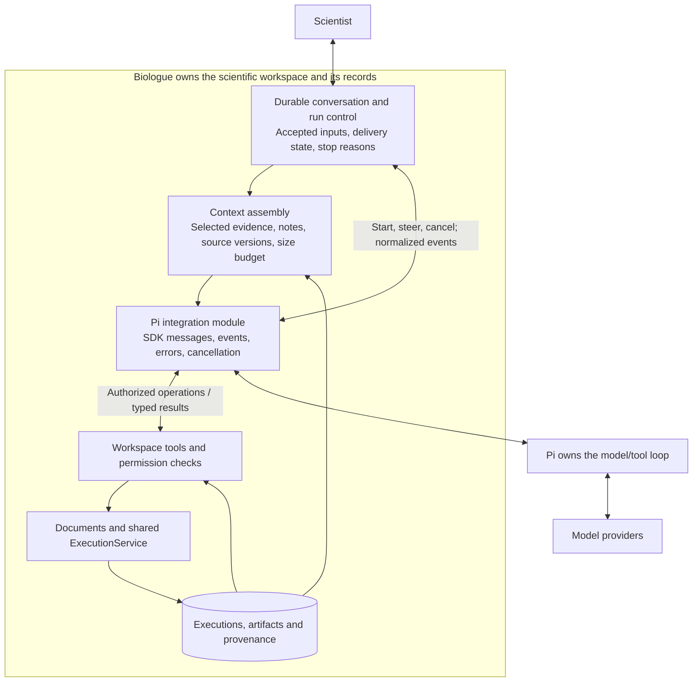

# Pi integration boundary audit

**Historical audit, followed by an implemented migration.** Biologue now embeds
`pi-coding-agent` AgentSession 0.87.1. The descriptions and diagnostic results
below describe the earlier agent-core implementation. See
[the current architecture](architecture.md#the-implemented-pi-boundary) for the
implemented boundary and [verification](verification.md) for current checks.
The diagnostic entry point now runs the AgentSession regression suite and exits
nonzero on failure. It does not reproduce the old defects as successful probes.

The migration addresses A1–A6 with durable input receipts tied to Pi history,
SDK settling/recovery and explicit incomplete outcomes, tool error propagation,
bounded evidence retrieval, image retrieval, and versioned session/run identity.
Compaction retains the original transcript and uses scientific retention
instructions. These changes establish integration behavior, not scientific
reasoning quality.

Audited September 26, 2026 against Biologue's working tree and installed
`@earendil-works/pi-agent-core` / `@earendil-works/pi-ai` **0.87.1**.

**Verdict: keep the basic architecture. Harden the integration before relying on
it for sustained scientific investigations.** Pi owns the model/tool loop; Biologue
owns the scientist's context, permissions, documents, execution, and records.
That division is sensible. The incomplete parts are the contracts for durable
input, stopping, tool outcomes, and information returned to the model.

An **integration boundary** is the agreement between Biologue and Pi about requests,
results, state, and responsibility. A **module** is a unit of code implementing
some of that agreement. The wider **agent subsystem** includes the supervisor,
context handling, Pi integration, and workspace tools. This audit examines that
subsystem's boundary with Pi, rather than desktop packaging.

Evidence includes source inspection, version-matched Pi documentation and runtime
code, primary sources from other harnesses, the existing service tests, and
[reproducible diagnostic probes](../scripts/audits/pi-boundary.ts). The probes use
the real Pi loop and Biologue services with a scripted provider and fake kernel.
They establish integration behavior, not model reasoning quality or live-provider
compatibility. No application behavior was changed for this audit.

**Which Pi are we embedding?**

Biologue uses the general-purpose `Agent` from **pi-agent-core**, with `pi-ai` for
provider access. We supply its prompt, history, and tools. This is supported
usage. Pi exposes context transformation and request/turn hooks, and its
`sessionId` setting supports provider caching; it does not activate durable
conversation storage. [Pi agent-core documentation, v0.87.1](https://github.com/earendil-works/pi/blob/v0.87.1/packages/agent/README.md)

Pi also offers the higher-level **pi-coding-agent SDK**. Its `AgentSession` adds
session lifecycle, queues, compaction, retries, and resource loading. Its
`SessionManager` is authoritative for persisted model context. These facilities
are not automatically included in our lower-level integration.
[Pi session SDK documentation, v0.87.1](https://github.com/earendil-works/pi/blob/v0.87.1/packages/coding-agent/docs/sdk.md)

The higher-level SDK can be customized; its name does not require us to expose a
shell. Pi documents replacing resource discovery and selecting tools. It is a
possible reuse option, but adopting it requires choosing a single authority for
conversation history. Keeping independent Biologue and Pi histories and hoping they
agree would perpetuate our main problem.
[Pi full-control example](https://github.com/earendil-works/pi/blob/v0.87.1/packages/coding-agent/examples/sdk/12-full-control.ts),
[tool configuration example](https://github.com/earendil-works/pi/blob/v0.87.1/packages/coding-agent/examples/sdk/05-tools.ts)

**The current implementation**



The effective Pi integration spans `pi.ts` **and** `supervisor.ts`. `PiAdapter`
currently acts primarily as a factory; it does not encapsulate the entire agent
runtime. That is a manageable amount of coupling in a small application. Its
name should not imply stronger isolation than it provides.

The following choices should be preserved:

- Human and agent execution, including object inspection, use `ExecutionService`.
  The model receives no separate shell or hidden Python/R runtime.
- The host enforces approval of the actual code or replacement buffer. Document
  versions prevent an approved edit from overwriting a newer buffer silently.
- Pi tool execution is sequential, while the execution service also serializes
  operations within each language. The latter remains necessary because humans
  and other conversations share those kernels.
- Scientific instructions and versioned research notes belong to Biologue. Our
  provider-boundary probe confirms that a subsequent run receives corrected
  notes and prior conversation, with the previous system notes replaced.
- Unfinished execution after an application restart is marked abandoned rather
  than automatically repeated. This is appropriate for a mutable scientific
  session whose state may have changed before the crash.

Sources: [Pi adapter](../packages/server/src/pi.ts),
[supervisor](../packages/server/src/supervisor.ts),
[execution service](../packages/server/src/execution.ts),
[document service](../packages/server/src/documents.ts).

**Findings, in priority order**

P1 means fix before trusting extended investigations. P2 means address as the
integration is hardened; the observed limitation and its consequences are stated
separately below.

| ID  | Priority | Finding                                                               | Evidence                                                                                                         |
| --- | -------- | --------------------------------------------------------------------- | ---------------------------------------------------------------------------------------------------------------- |
| A1  | P1       | A queued scientist correction can disappear from future model context | Reproduced after provider failure and cancellation during a provider request                                     |
| A2  | P1       | An unfinished or truncated response can be recorded as completed      | Reproduced at the 12-turn cap and with provider `length` / `aborted` stops                                       |
| A3  | P2       | Failed execution is reported as a successful Pi tool operation        | Reproduced: execution `failed`, Pi `isError: false`                                                              |
| A4  | P2       | Context has no model-aware size or retention policy                   | A 230,000-character document passed intact into the next provider request                                        |
| A5  | P2       | Captured figures do not reach the model as images                     | Reproduced: image persisted, no image in tool response and no artifact retrieval tool                            |
| A6  | P2       | Persistence records lack a complete, versioned integration contract   | Source inspection: independent display/transcript writes, unversioned SDK payloads, incomplete request manifests |

**A1 — The application can show a correction that the next model never receives.**

At `Supervisor.steer` (lines 235–239), Biologue immediately saves a display message
and puts the same text in Pi's in-memory steering queue. Future runs reconstruct
model history from the separately stored Pi transcript. A queued message is not
yet part of that transcript.

The diagnostic waits for a provider request to start, sends a correction about
the experimental batch, then either returns a provider error or cancels the run.
In both cases, the correction remains visible in chat but is absent from the
stored transcript and the next provider request. Cancellation while awaiting
tool approval preserved it in a separate probe; the failure depends on the point
at which the loop stops.

This is directly relevant to Biologue's purpose: the interface can appear to have
remembered knowledge that the scientist supplied, while the next analysis lacks
it. Pi's loop has exits that occur before pending inputs are drained.
[Pi loop implementation](https://github.com/earendil-works/pi/blob/v0.87.1/packages/agent/src/agent-loop.ts)

Fix by durably recording accepted inputs with stable IDs and delivery state
before enqueueing them. A message should remain pending until incorporated into
model context, or be explicitly withdrawn. On failure, cancellation, or restart,
reconcile pending inputs without duplicating already delivered messages. Derive
display and model history from the same durable conversation record. Do not
reconstruct model context from the text-only chat view, which omits tool traffic.

**A2 — Stopping and successful completion are conflated.**

`Supervisor` line 180 forcibly ends the loop after 12 turns. Lines 197–198 only
recognize the provider's `error` stop reason, and lines 209–223 classify an
otherwise resolved prompt as completed.

With 12 consecutive tool calls, Biologue records `completed` although the last
transcript entry is a tool result and the model has not interpreted it. A
scripted final answer remains unused. A response truncated with `length` also
becomes `completed`. A provider-level `aborted` response becomes `completed`
unless Biologue's own cancellation path has already set the run status.

Record an explicit termination reason: normal response, configured limit,
truncation, cancellation, or provider failure. Make limits configurable and
visible, retain pending inputs, and support deliberate continuation. Await
settlement when an API operation promises that cancellation has finished.

This is about operational status. Even a normal model response only completes
that response; it does not establish that an investigation is finished or a
scientific interpretation is valid.

**A3 — Execution failure is not translated into Pi's error protocol.**

`execute_code` (lines 135–149) and `inspect_environment` (lines 100–107) return
execution records without checking their terminal status. The error remains
visible inside the JSON text, but Pi marks the tool result `isError: false`.
The failure is therefore represented inconsistently across the boundary.

Translate a failed or interrupted execution into an explicit tool error while
preserving its execution ID and useful diagnostic output. Pi supports thrown
tool errors and an `afterToolCall` override of the error flag. A model may then
recover; a failed intermediate computation need not fail the entire conversation.
[Pi tool-error guidance](https://github.com/earendil-works/pi/blob/v0.87.1/packages/agent/README.md),
[Pi tool-result hook contract](https://github.com/earendil-works/pi/blob/v0.87.1/packages/agent/src/types.ts)

**A4 — Context assembly works for short exchanges but has no sustained-use policy.**

Every run loads the whole saved transcript. `read_document` returns the entire
buffer, up to the document service's 2 MB file-open limit; execution output can
also grow substantially. Neither `transformContext` nor another request-budget
policy is configured. A 12-turn limit does not limit accumulated context across
multiple runs.

The diagnostic demonstrates unabridged passage of a 230,000-character document;
it does not claim that this specific input exceeded a live model's limit.
Continued accumulation creates a predictable risk of expensive requests,
context-limit errors, and difficulty retaining the relevant scientific evidence.

Give context assembly an explicit owner and testable output. Bound previews,
provide range/query retrieval, keep full artifacts outside the prompt, reserve
space for new results, and record what was included or omitted. Preserve
scientist corrections, qualifications, source links, and unresolved assumptions
when introducing summaries. Tool-call/result pairs must remain valid.

Research notes are currently snapshotted at run start. Decide explicitly whether
edits affect only the next run or the next request within the active run; either
choice needs visible versioning. Moving the assembly function into
`ContextService` alone would not solve any of these behavioral issues.

Anthropic's published context guidance recommends selective retrieval and
managing the finite context budget throughout an interaction. That supports
bounded evidence retrieval here without requiring a vector database.
[Context engineering guidance](https://www.anthropic.com/engineering/effective-context-engineering-for-ai-agents)

**A5 — The scientist and model have different access to the evidence.**

At `Supervisor` lines 142–148, `execute_code` deliberately keeps only
`text/plain` from rich MIME output. The full figure is preserved for Biologue's
workbench, but the supplied tool set offers no artifact-reading operation that
returns it to the model. A representation such as `<Figure ...>` does not let
the model check axes, labels, or visual patterns.

Return compact artifact references and add bounded, on-demand retrieval of
images, tables, execution details, and relevant metadata. Deliver supported
images as Pi image content to models that accept them. Keep the distinction
between an artifact existing and the model having inspected it. This preserves
context capacity while allowing the same evidence to inform human and agent.

**A6 — The history and provenance contract needs to survive SDK changes and interruption.**

The supervisor persists raw `AgentMessage[]` directly, without an SDK/schema
version envelope. It separately writes display messages. The `run-input`
record preserves a useful initial prompt/history snapshot, but not a complete
per-request manifest: it precedes the current user message and does not identify
the tool schema or later context decisions. Tool handlers discard Pi's call ID,
so execution and permission records do not carry that direct correlation.

Retain raw SDK message payloads where needed, including provider-specific content;
wrap them in versioned records with Biologue IDs. Link input, run, tool call,
permission, execution, and artifact IDs. Record the resolved model, prompt/tool
versions, and selected context references for each request. Reconcile unfinished
tool calls against execution records after interruption without blindly
repeating scientific code. A raw transcript remains useful evidence, but its
storage format needs an explicit compatibility policy.

These are design gaps identified in source. The audit did not perform a process-
kill durability test or an SDK-upgrade migration test.

**Comparison with other harnesses**

| Primary source                                                                                                              | What it establishes                                                                                                                | Implication for Biologue                                                                                                                                                                                                                         |
| --------------------------------------------------------------------------------------------------------------------------- | ---------------------------------------------------------------------------------------------------------------------------------- | ------------------------------------------------------------------------------------------------------------------------------------------------------------------------------------------------------------------------------------------------ |
| [Claude Science announcement](https://www.anthropic.com/news/claude-science-ai-workbench)                                   | A coordinating agent, persistent scientific sessions, selective model context, artifact provenance, and figure/manuscript feedback | Our shared sessions and provenance direction fit these published behaviors. Artifact feedback and selective context need work. The page does not document its internal SDK boundary; equivalent internals cannot be claimed.                     |
| [Anthropic Managed Agents engineering](https://www.anthropic.com/engineering/managed-agents)                                | Durable session events, a model/tool harness, and execution environments have separate interfaces                                  | Keep conversation records independent of an individual Pi instance, and keep kernel execution behind Biologue's service. These can remain logical boundaries in one local application; the comparison does not require a distributed deployment. |
| [OpenHands conversation architecture](https://docs.openhands.dev/sdk/arch/conversation)                                     | Conversation orchestration includes lifecycle, execution status, workspace coordination, and an append-only event log              | Our supervisor has a legitimate role. Its input delivery and outcome bookkeeping need a clearer durable contract.                                                                                                                                |
| [Anthropic autonomous-agent example](https://github.com/anthropics/claude-quickstarts/blob/main/autonomous-coding/agent.py) | A host orchestrates SDK sessions and continuation, uses persistent project state, and reports iteration limits                     | Host orchestration outside the SDK is ordinary. Starting a fresh agent instance is acceptable when context and pending work are restored correctly. The example is a coding demo, not evidence of scientific quality.                            |

The comparator-derived recommendations are architectural inferences, not claims
that Biologue must copy any product's private implementation.

**Recommended boundary**



This is a proposed organization, not a description of changes made in this audit.
It can be implemented with a few functions/modules in the existing Node server.
The immediate value comes from reliable contracts, rather than the number or
names of classes.

**Decision update following the preference for maximum Pi SDK reuse:** migrate
to `pi-coding-agent`'s `createAgentSession`, using `SessionManager` for canonical
conversation history and `AgentSessionRuntime` where session replacement,
resumption, or branching is needed. This supersedes the audit's initial
recommendation to retain the core engine for immediate fixes. Review of the
0.87.1 SDK and source found supported customization points for Biologue's required
behavior. The migration has not been implemented or tested for behavioral parity.

Pi should own transcript reconstruction, compaction, retries, and agent session
lifecycle. Biologue should keep scientific notes, shared execution, document buffers,
permission decisions, artifacts, and their provenance. SQLite can retain Biologue's
records and references to Pi session entries; it should not remain a competing
authority for the same model transcript.

The migration needs several explicit choices:

- Replace the default coding prompt with Biologue's scientific prompt and inject
  versioned research context through supported prompt/context hooks.
- Select Biologue's custom tools explicitly. Keep reads and edits attached to live
  buffers and keep execution and inspection in `ExecutionService`. Preserve
  sequential tool behavior and coordinate Pi abort with kernel interruption.
- Make skill loading compatible with those tools. Pi's prompt builder advertises
  skills when a tool named `read` or `bash` is active. A Biologue-backed `read` tool
  can support live project buffers and approved skill resources without enabling
  a separate shell.
- Customize scientific retention during compaction and branch summaries; the
  default format emphasizes goals, progress, decisions, and file operations.
  Versioned observations and corrections should remain independently retrievable.
- Keep durable receipts for user input accepted before Pi consumes it. Pending
  steering queues live in memory; session storage is not by itself a guarantee
  that a newly submitted correction survives every interruption.
- Treat Pi conversation branches separately from R/Python kernel state. Branching
  conversation history does not snapshot or restore a live scientific session.

These choices use the documented [session SDK](https://github.com/earendil-works/pi/blob/v0.87.1/packages/coding-agent/docs/sdk.md),
[tool selection options](https://github.com/earendil-works/pi/blob/v0.87.1/packages/coding-agent/src/core/sdk.ts),
[prompt construction](https://github.com/earendil-works/pi/blob/v0.87.1/packages/coding-agent/src/core/system-prompt.ts),
[compaction extension points](https://github.com/earendil-works/pi/blob/v0.87.1/packages/coding-agent/docs/compaction.md),
and [session implementation](https://github.com/earendil-works/pi/blob/v0.87.1/packages/coding-agent/src/core/agent-session.ts).
Extensions that expect Pi's terminal UI or unrestricted shell access need
adaptation to Biologue; session SDK adoption does not make every extension compatible.

The practical sequence is:

1. Migrate the conversation integration to AgentSession, preserving existing
   histories and fixing A1/A2 with regression tests for input delivery and
   termination. Map final outcomes after Pi's recovery and settling lifecycle;
   intermediate retry errors must not prematurely finish Biologue's run.
2. Establish the versioned conversation/request contract and consistent A3 tool
   errors; keep scientific context selection and tool-result translation explicit.
3. Add bounded evidence retrieval and a context-retention policy. Then evaluate
   scientific behavior with scientists: whether a supplied correction changes
   the next analysis, whether questions resolve consequential ambiguity, and
   whether observations remain distinct from interpretations.

**Verification and reproduction**

The existing `npm test` suite passed **10/10** during this audit. The additional
script ran **10 diagnostic scenarios**, including successful context delivery,
the timing-specific correction loss, run outcomes, error mapping, figure access,
and document size. It prints observations and exits normally when probes finish;
that exit code does not mean the diagnosed defects are fixed.

The production build, a separate TypeScript check of the diagnostic script, and
format checks of the two audit files also passed.

```bash
docker exec -i -w /workspace/biologue codex-universal bash -lc \
  'source /root/.nvm/nvm.sh && nvm use 22 >/dev/null && ./node_modules/.bin/tsx scripts/audits/pi-boundary.ts'
```

The script substitutes Pi's provider construction, captures requests at the
provider interface, creates disposable projects and SQLite databases, and
removes them afterward. It makes no external model calls and starts no kernel.
The unmodified application still needs live-provider checks and scientist-led
evaluation; the diagnostic results should not be interpreted as those checks.
